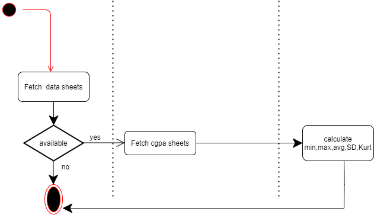
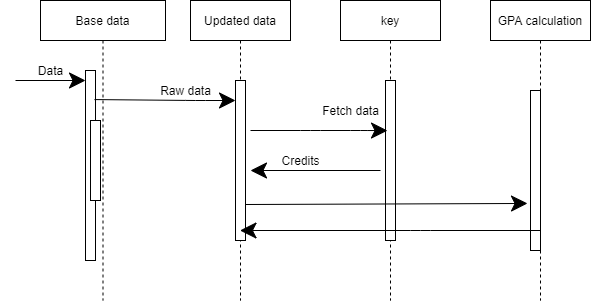

#  High Level Design and Low Level Design 

## Usecase Diagram

## Activity Diagrams For CGPA calculation

## Activity Diagrams For Batch Analysis

## UML Diagram

## Sequence Diagram

Activity1 (1)..png

